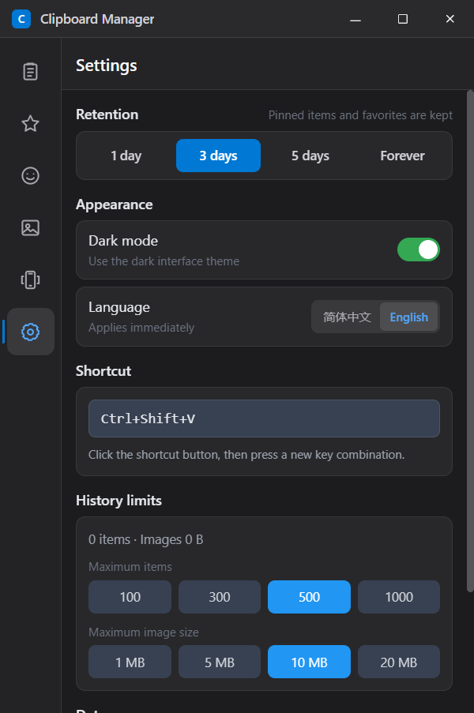
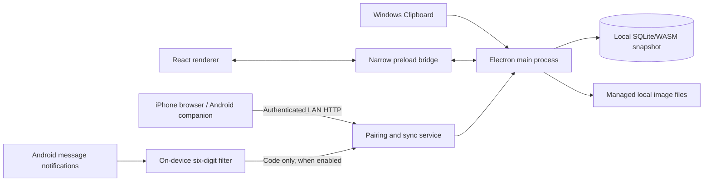

# 📋 Clipboard Manager — Windows Clipboard History Tool

A lightweight, efficient Windows desktop clipboard manager. Runs silently in the background, auto-saves text and image clipboard entries, and provides real-time search, editable copy, Emoji, pin, favorite, batch management, and a sticker library — the missing power tool for your Windows clipboard.

[中文版](README_CN.md)

[](https://github.com/adlk-bit/clipboard-manager/actions/workflows/ci.yml)
[](LICENSE)

> **Project status:** Actively maintained by a small project. Real Windows/Android feedback and reproducible Issues are welcome. Stars and download counts are not presented as evidence of broad adoption.

---

## Runtime Screenshot



Captured from the actual Electron runtime at the default 400 × 600 window size. The interface can switch immediately between Simplified Chinese and English from Settings.

---

## ✨ Features

| Module | Description |
|------|------|
| 🔄 **Live Auto-Capture** | New clipboard entries appear in the open window immediately; text and images are saved in the background |
| ⏸️ **Privacy Pause** | Pause or resume capture from the history toolbar or tray; the choice persists across restarts and content copied while paused is not captured later |
| ♻️ **Smart Deduplication** | Identical text and images merge into one entry with a usage count and last-used time, keeping history compact |
| 🔥 **Frequently Used View** | Switch between newest and most-used entries to reach recurring content faster |
| 📌 **Organized Favorites** | Pin or favorite important entries, then add folders/tags and reorder favorites |
| 🔍 **Live Search** | Fuzzy-match text content as you type, lightning fast |
| 🔗 **Quick-Open URLs** | URL-only clipboard items can be opened safely in the default browser |
| ✏️ **Edit Before Copy** | Edit any text entry in a focused dialog, then copy the revised content without overwriting the original history item |
| 😀 **Emoji Picker** | Browse 233 built-in Emoji across seven categories, search in Chinese or English, and quickly reuse recent choices |
| 🖼️ **Sticker Library** | Import local images as stickers, click to copy to clipboard |
| 📱 **Phone Sharing** | Pair iPhone or Android over the same LAN, exchange text with Windows, and manage connected devices |
| 🔢 **Verification Code Relay** | iPhone uses a Messages Shortcut; Android uses explicit notification access and relays only six digits without retaining history |
| ☑️ **Batch Mode** | Select multiple entries for bulk deletion |
| 🗑️ **Auto-Cleanup** | Choose 1 / 3 / 5 days or forever; expiry follows last use and removes linked image files |
| 🌙 **Compact System UI** | A space-efficient light/dark interface with unified SVG icons, clear primary actions, and reduced-motion support |
| 🌐 **Bilingual Interface** | Switch the full desktop interface between Simplified Chinese and English in Settings; the choice persists across restarts |
| 📤 **Portable Backup & Restore** | `.clipbackup` includes text, images, stickers, favorite metadata, and safe settings; merge/replace restore and legacy JSON import are supported |
| 🛡️ **Local Data Protection** | Atomic database snapshots, startup integrity repair, restricted local-asset access, CSP, and sandboxed rendering |
| ⌨️ **Configurable Hotkey** | Record a new global shortcut directly in Settings; `Ctrl+Shift+V` is the default |
| 📊 **Storage Controls** | Set history capacity and maximum clipboard-image size, then inspect current usage |
| 🪟 **Native Window Controls** | Frameless system-style header with minimize, maximize/restore, and tray-safe close controls |

---

## 🚀 Installation

### Download Installer

Go to [Releases](https://github.com/adlk-bit/clipboard-manager/releases) and download:

- Windows: `ClipboardManager-Setup-1.1.1.exe`; run it to install.
- Android: `ClipboardManager-Android-1.1.1.apk`; allow your browser or file manager to install unknown apps, then install it.

### Build from Source

```bash
# Clone the repo
git clone https://github.com/adlk-bit/clipboard-manager.git
cd clipboard-manager

# Install dependencies
npm install

# Dev mode (hot reload)
npm run dev

# Production build & package
npm run dist
```

> **Requirements:** Node.js ≥ 18 · npm ≥ 9 · Windows 10/11

---

## 📱 Phone Clipboard and Verification Codes

1. Connect the PC and phone to the same trusted Wi-Fi and keep the desktop app running (it may stay in the tray).
2. Open **Connected Devices** in the sidebar, select the correct PC network, and choose **Generate pairing QR code**. If Windows Firewall asks, allow private networks only.
3. **iPhone:** Scan with Camera and confirm in Safari. For codes, follow the page to create a **When I Receive a Message** personal automation and choose **Run Immediately**.
4. **Android:** Install the companion APK, scan with Camera, then choose **Open Android app**. Clipboard exchange is user-initiated while the app is foregrounded. To relay codes, explicitly grant notification access in the app.
5. The desktop list shows the platform and online status, can disable codes per device, and can revoke a device. Phones can also disconnect themselves.

> **iOS limitation:** Third-party apps and web pages cannot directly read the iPhone SMS inbox. This implementation uses Apple's Messages trigger in Shortcuts, so only a personal automation explicitly configured by the user relays the matched six digits.

> **Android permissions:** The companion requests neither `READ_SMS` nor `RECEIVE_SMS`. Notification access is explicitly granted by the user in system settings. It inspects only message-style notifications, requires verification-code context and exactly one six-digit value, and never stores or transmits full notification text. Android 10+ blocks arbitrary background clipboard reads, so normal clipboard actions require the foreground app and a user tap.

> **Network security:** No cloud relay is used. Pairing QR codes expire after five minutes, Android credentials are encrypted through Android Keystore, and the PC stores only the device-secret hash. LAN transport is currently HTTP, so use it only on trusted home or personal Wi-Fi, never public Wi-Fi. Pair again if the PC address changes.

See [android/README.md](android/README.md) for Android source, build, install, and privacy details.

---

## 🆕 What's New in v1.1.1

- Fixed the dark-mode switch direction so the thumb consistently follows the selected state; the phone verification-code switch now uses the same geometry.
- Added a persistent Simplified Chinese / English selector in Settings and localized the complete desktop interface, tray menu, dialogs, and native prompts.
- Added GitHub Actions for desktop tests, TypeScript checking, production builds, Android unit tests, and Android lint.
- Added security and contribution policies, Issue/PR templates, a real runtime screenshot, architecture notes, a privacy threat model, and a maintainer automation proposal.

## What's New in v1.1.0

- Added **Connected Devices** to the sidebar, with LAN-interface selection, five-minute pairing QR codes, and controls to inspect, configure, or revoke paired iPhone and Android devices.
- Added bidirectional phone-to-Windows text transfer: iPhone uses the pairing web page and Android uses the open-source Kotlin companion; normal clipboard actions remain explicitly user initiated on the phone.
- Added six-digit verification-code relay through an iPhone Messages personal automation or Android notification access explicitly granted by the user.
- Added Android deep-link pairing, Keystore-encrypted credentials, code deduplication, notification source/context filtering, and phone-initiated disconnect.
- Restricted the phone service to private LAN addresses, made QR tokens single-use, stored only device-secret hashes on Windows, and added per-device code controls and revocation.
- Added an MIT license, bilingual Android build/privacy documentation, and tests for the desktop protocol, pairing security, code filtering, and Android URL validation.

---

## 🎮 Usage

| Action | How |
|------|------|
| Open window | `Ctrl+Shift+V` or double-click tray icon |
| Browse history | Sidebar → "All Records" |
| Copy an item | Click 📋 on any card, or use ↑ / ↓ then Enter |
| Edit then copy | Click the pencil button beside Copy, edit the text, then choose “Copy edited content” or press `Ctrl+Enter` |
| Change history order | In All Records, choose “Newest” or “Frequently Used” |
| Pause/resume capture | In All Records, click “Pause capture”, or use the tray menu |
| Pin | Hover card → click 📌 |
| Favorite | Hover card → click ⭐ |
| Organize favorites | In Favorites, use the card actions to edit folders/tags or reorder |
| Open a URL | Hover a URL-only item → click 🔗 |
| Delete | Hover card → click 🗑️ |
| Batch select | Click “Batch manage” below the list to enter multi-select mode |
| Search | Type in the search bar at top |
| Emoji | Sidebar → "Emoji" → choose a category or search → click an Emoji to copy |
| Stickers | Sidebar → "Stickers" → Import → click image to copy |
| Connect phone | Sidebar → "Connected Devices" → generate QR → scan with the phone Camera |
| Android codes | Android companion → enable relay → grant notification access in system settings |
| iPhone codes | Paired iPhone page → follow the Messages personal-automation guide |
| Revoke phone | Sidebar → "Connected Devices" → paired device → 🗑️ |
| Settings | Sidebar → "Settings" → retention / appearance / language / custom hotkey / storage limits |
| Backup | Settings → Complete Backup / Restore Backup, then choose merge or replace |

---

## 📁 Project Structure

```
clipboard-manager/
├── electron/main/                 # Main process
│   ├── index.ts                   # Window, tray, hotkey
│   ├── database.ts                # SQLite CRUD
│   ├── clipboard-monitor.ts       # Clipboard polling
│   ├── ipc-handlers.ts            # IPC handlers
│   ├── mobile-sync.ts             # Phone LAN pairing, authentication, and sync
│   ├── mobile-page.ts             # Phone web UI, Android deep link, and iOS Shortcut guide
│   ├── backup.ts                  # Portable backup validation/archive
│   ├── asset-paths.ts             # Managed local-asset boundaries
│   └── scheduler.ts               # Expiry cleanup scheduler
├── electron/preload/
│   └── index.ts                   # Secure bridge API
├── src/                           # Renderer (React)
│   ├── App.tsx
│   ├── components/
│   │   ├── Layout.tsx             # Shell layout
│   │   ├── Sidebar.tsx            # Nav (All / Favorites / Emoji / Stickers / Devices / Settings)
│   │   ├── HistoryList.tsx        # History list
│   │   ├── HistoryCard.tsx        # Card (edit / copy / pin / fav / delete)
│   │   ├── EditCopyDialog.tsx     # Edit-before-copy dialog
│   │   ├── EmojiPicker.tsx        # Searchable categorized Emoji picker
│   │   ├── DevicesPanel.tsx       # QR pairing and connected-device management
│   │   ├── Icon.tsx               # Shared SVG icon set
│   │   ├── SearchBar.tsx          # Search input
│   │   ├── StickerGrid.tsx        # Sticker grid
│   │   ├── StickerCard.tsx        # Sticker card
│   │   ├── SettingsPanel.tsx      # Settings panel
│   │   ├── ExportImport.tsx       # Export & import
│   │   ├── ConfirmDialog.tsx      # Confirm dialog
│   │   └── Toast.tsx              # Toast notification
│   ├── stores/useStore.ts         # Zustand state
│   ├── data/emojis.ts             # Built-in Emoji catalog and keywords
│   ├── types/index.ts             # TypeScript types
│   └── styles/index.css           # Tailwind + global styles
├── resources/                     # Static assets
│   ├── icon.png                   # App icon (256×256)
│   ├── icon.ico                   # Windows icon
│   └── tray-icon.png              # Tray icon (16×16)
├── android/                       # Open-source Kotlin Android companion
│   ├── app/src/main/              # Deep-link pairing, clipboard, and notification-code relay
│   ├── app/src/test/              # Private-network and OTP extraction tests
│   └── README.md                  # Android build, install, and privacy notes
├── electron.vite.config.ts
├── electron-builder.yml
├── tailwind.config.js
└── package.json
```

---

## Architecture and Trust Boundaries



- The renderer is sandboxed and cannot access Node.js directly; validated IPC methods cross the preload boundary.
- Clipboard history, images, settings, pairing hashes, and backups remain on the user's devices. The project does not operate a cloud relay.
- Phone pairing is intentionally limited to private numeric IPv4 addresses, short-lived single-use QR tokens, authenticated requests, and explicit revocation.
- Windows and Android release signing are maintainer-controlled and are not performed by pull-request CI.

### Privacy Threat Model

| Asset or boundary | Main threats considered | Current controls | Residual risk / user action |
|---|---|---|---|
| Clipboard history and images | Unintended retention, oversized images, corrupt snapshots | Privacy pause, retention/capacity limits, atomic snapshots, startup integrity repair, managed image paths | Any clipboard manager holds sensitive content; pause capture or clear history before handling secrets |
| Renderer, IPC, and local files | Untrusted renderer input, navigation, arbitrary file access | Context isolation, sandbox, CSP, denied navigation, narrow preload API, validated IPC input, managed asset directories | A compromised OS account or local process is outside the application's isolation boundary |
| LAN pairing and sync | Public-network exposure, token reuse, unauthorized device, leaked device secret | Private IPv4 validation, five-minute single-use tokens, hashed secrets on Windows, authenticated requests, per-device controls and revocation | Transport is HTTP, not end-to-end encrypted; use trusted private Wi-Fi only and never share a live QR/URL |
| Android verification codes | Excessive notification collection, SMS permission abuse, replay | No SMS permissions, explicit notification access, message/context checks, unique six-digit extraction, deduplication, code-only relay, no history retention | Notification access is powerful; enable it only when needed and review the Android source/build |
| Backups and release artifacts | Path traversal, malformed archive, leaked signing material, substituted binary | Archive validation and size limits, managed extraction paths, CI tests/lint, local signing secrets, published artifact names | Backups contain private clipboard data and are not encrypted by the app; store and transfer them securely |

Security reports should use the private process in [SECURITY.md](SECURITY.md), not a public Issue.

---

## 🛠️ Tech Stack

| Layer | Technology |
|---|------|
| Framework | Electron 43 |
| UI | React 18 + TypeScript |
| Build | Vite 5 + electron-vite 3 |
| Styling | Tailwind CSS 3 |
| State | Zustand 5 |
| Database | sql.js (SQLite WASM) |
| Packaging | electron-builder (NSIS) |

---

## 📦 Custom Packaging

Edit `electron-builder.yml`:

```yaml
appId: com.clipboard.manager
productName: ClipboardManager
win:
  target: [nsis]
  icon: resources/icon.ico
nsis:
  oneClick: false
  allowToChangeInstallationDirectory: true
  createDesktopShortcut: true
```

---

## Contributing and Feedback

- Read [CONTRIBUTING.md](CONTRIBUTING.md) for desktop/Android setup, required checks, redaction rules, and PR expectations.
- Submit a reproducible [Bug report](https://github.com/adlk-bit/clipboard-manager/issues/new?template=bug_report.yml) or a focused [Feature request](https://github.com/adlk-bit/clipboard-manager/issues/new?template=feature_request.yml).
- Real-device Windows and Android results are particularly valuable; state the tested version and what remains unverified.
- Maintainer automation is intentionally narrow and auditable. See the [verifiable automation plan](docs/maintainer-automation-plan.md) for proposed PR review, IPC/LAN security, dependency, and dual-platform release-QA workflows.

---

## 📄 License

The source code of this project is released under the [MIT License](LICENSE). You may use, copy, modify, merge, publish, distribute, sublicense, and/or sell copies of the software, provided that the original copyright notice and license notice are retained. See [LICENSE](LICENSE) for the full license text.
