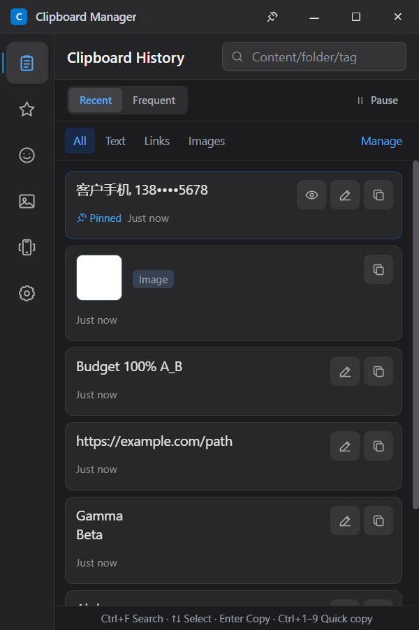
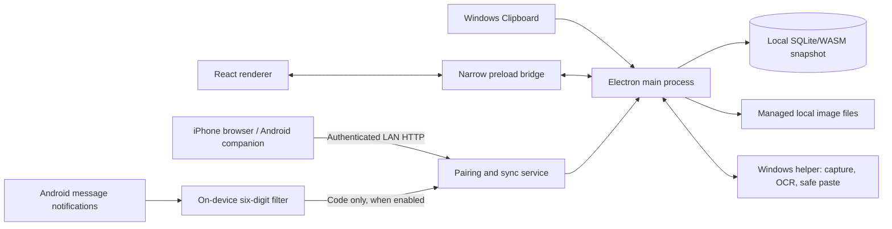

# 📋 Clipboard Manager — Windows Clipboard History Tool

A lightweight, efficient Windows desktop clipboard manager. Runs silently in the background, auto-saves text and image clipboard entries, and provides real-time search, editable copy, Emoji, pin, favorite, batch management, and a sticker library — the missing power tool for your Windows clipboard.

[中文版](README_CN.md)

[](https://github.com/adlk-bit/clipboard-manager/releases/latest)
[](https://github.com/adlk-bit/clipboard-manager/actions/workflows/ci.yml)
[](LICENSE)

> **Project status:** Actively maintained by a small project. Real Windows/Android feedback and reproducible Issues are welcome. Stars and download counts are not presented as evidence of broad adoption.

---

## Runtime Preview



Captured from the actual Electron runtime at the default 400 × 600 window size. The current release is **v1.2.2**; the interface can switch immediately between Simplified Chinese and English from Settings.

---

## ✨ Features

| Module | Description |
|------|------|
| 🔄 **Live Auto-Capture** | Native clipboard-change notifications plus sequence checks capture new text and images immediately without repeatedly encoding unchanged images |
| ⚡ **Quick Paste** | Open from a destination with the global shortcut, choose a text record, and paste it back to the original app with `Enter`; copy-only and safe-fallback paths remain available |
| ⏸️ **Privacy Pause** | Pause or resume capture from the history toolbar or tray; the choice persists across restarts and content copied while paused is not captured later |
| ♻️ **Smart Deduplication** | Identical text and images merge into one entry with a usage count and last-used time, keeping history compact |
| 🔥 **Frequently Used View** | Switch between newest and most-used entries to reach recurring content faster |
| 📌 **Organized Favorites** | Pin or favorite important entries, then add folders/tags and reorder favorites |
| 🔍 **Live Search** | Filter text, links, or images; match all space-separated keywords across content, folders, and tags, including literal `%` / `_` searches |
| 👁️ **Sensitive Preview Masking** | Hide phone numbers, email addresses, IDs, valid bank cards, and common secrets in previews while preserving the original copied value |
| 🔗 **Quick-Open URLs** | URL-only clipboard items can be opened safely in the default browser |
| ✏️ **Edit Before Copy** | Trim lines, remove blank/duplicate lines, join lines, change case, format/minify JSON, undo, and reset without overwriting the original record |
| 🧩 **Phrases & Templates** | Save reusable text with `{{variables}}`, fill values, preview the result, and copy it with date/time defaults |
| ⏭️ **Sequential Paste Queue** | Queue multiple text records and paste them one at a time with `Ctrl+Shift+Alt+V`, including pause, skip, rewind, and target checks |
| 🔎 **Local OCR** | Recognize clipboard images with installed Windows OCR languages, search or edit the result, and clear cached indexes |
| 🎯 **Source Controls** | Filter history by source app and exclude selected process names from capture |
| 😀 **Emoji Picker** | Browse 233 built-in Emoji across seven categories, search in Chinese or English, and quickly reuse recent choices |
| 🖼️ **Sticker Library** | Import local images as stickers, click to copy to clipboard |
| 📱 **Phone Sharing** | Pair iPhone or Android over the same LAN, exchange text with Windows, and manage connected devices |
| 🔢 **Verification Code Relay** | iPhone uses a Messages Shortcut; Android uses explicit notification access and relays only six digits without retaining history |
| ☑️ **Batch Mode** | Enter selection from the top toolbar; delete or merge text records with newline, blank-line, comma, or tab separators and a reversible order preview |
| 🗑️ **Auto-Cleanup** | Choose 1 / 3 / 5 days or forever; expiry follows last use and removes linked image files |
| 🌙 **Compact System UI** | A space-efficient light/dark interface with unified SVG icons, clear primary actions, and reduced-motion support |
| 🌐 **Bilingual Interface** | Switch the full desktop interface between Simplified Chinese and English in Settings; the choice persists across restarts |
| 📤 **Portable Backup & Restore** | Format 2 `.clipbackup` files include text, images, stickers, favorite metadata, templates, OCR indexes, source metadata/exclusions, and safe settings; older formats still import |
| 🛡️ **Local Data Protection** | Atomic database snapshots, startup integrity repair, restricted local-asset access, CSP, and sandboxed rendering |
| ⌨️ **Configurable Hotkey** | Record a new global shortcut directly in Settings; `Ctrl+Shift+V` opens quick paste by default |
| 🚀 **Launch at Startup** | Enable or disable the packaged app's Windows login item from Settings |
| 📊 **Storage Controls** | Set history capacity and maximum clipboard-image size, then inspect current usage |
| 🪟 **Native Window Controls** | Frameless system-style header with persistent always-on-top, minimize, maximize/restore, and tray-safe close controls |

---

## 🚀 Installation

### Download Installer

Go to [Releases](https://github.com/adlk-bit/clipboard-manager/releases) and download:

- Windows: [ClipboardManager-Setup-1.2.2.exe](https://github.com/adlk-bit/clipboard-manager/releases/download/v1.2.2/ClipboardManager-Setup-1.2.2.exe); run it to install.
- Android: [ClipboardManager-Android-1.2.2.apk](https://github.com/adlk-bit/clipboard-manager/releases/download/v1.2.2/ClipboardManager-Android-1.2.2.apk); allow your browser or file manager to install unknown apps, then install it.

> **Signing note:** The v1.2.2 Windows installer is not Authenticode-signed, so Windows may show a SmartScreen warning. Download it only from this repository's official Release. The Android APK is v2-signed.

### Build from Source

```bash
# Clone the repo
git clone https://github.com/adlk-bit/clipboard-manager.git
cd clipboard-manager

# Install dependencies
npm install

# Dev mode (hot reload)
npm run dev

# Production build & package
npm run dist
```

> **Desktop development requirements:** Windows 10/11 · Node.js 22 · npm. The Windows native bridge is compiled automatically by the build scripts.

> **Android development requirements:** JDK 17 · Android SDK 36. See [android/README.md](android/README.md) for companion-app build instructions.

---

## 📱 Phone Clipboard and Verification Codes

1. Connect the PC and phone to the same trusted Wi-Fi and keep the desktop app running (it may stay in the tray).
2. Open **Connected Devices** in the sidebar, select the correct PC network, and choose **Generate pairing QR code**. If Windows Firewall asks, allow private networks only.
3. **iPhone:** Scan with Camera and confirm in Safari. For codes, follow the page to create a **When I Receive a Message** personal automation and choose **Run Immediately**.
4. **Android:** Install the companion APK, scan with Camera, then choose **Open Android app**. Clipboard exchange is user-initiated while the app is foregrounded. To relay codes, explicitly grant notification access in the app.
5. The desktop list shows the platform and online status, can disable codes per device, and can revoke a device. Phones can also disconnect themselves.

> **iOS limitation:** Third-party apps and web pages cannot directly read the iPhone SMS inbox. This implementation uses Apple's Messages trigger in Shortcuts, so only a personal automation explicitly configured by the user relays the matched six digits.

> **Android permissions:** The companion requests neither `READ_SMS` nor `RECEIVE_SMS`. Notification access is explicitly granted by the user in system settings. It inspects only message-style notifications, requires verification-code context and exactly one six-digit value, and never stores or transmits full notification text. Android 10+ blocks arbitrary background clipboard reads, so normal clipboard actions require the foreground app and a user tap.

> **Network security:** No cloud relay is used. Pairing QR codes expire after five minutes, Android credentials are encrypted through Android Keystore, and the PC stores only the device-secret hash. LAN transport is currently HTTP, so use it only on trusted home or personal Wi-Fi, never public Wi-Fi. Pair again if the PC address changes.

See [android/README.md](android/README.md) for Android source, build, install, and privacy details.

---

## 🆕 What's New in v1.2.2

- **Quick paste panel:** press the global shortcut (default `Ctrl+Shift+V`) from a destination input, search or select a text record, then press `Enter` or click **Paste selected** to paste back into the original app.
- `Ctrl+Enter` copies and hides; `Esc` cancels. Copy icons and `Ctrl+1`–`Ctrl+9` remain copy-only. Images are copy-only in this release. Opening from the tray retains the management workflow.
- Before input, check the original window/process, foreground focus and clipboard sequence, and wait for confirmation keys to be released. Switching away, cancelling or restarting clears the target. Failures preserve a usable copy when possible and ask you to check the destination, without automatically retrying or submitting forms.
- Android is synchronized to **1.2.2 / version code 9**, with unchanged phone features. Existing history and backup formats remain compatible.

See [v1.2.2 release notes](docs/releases/v1.2.2.md) for validation and compatibility limits.

## 🆕 What's New in v1.2.1

v1.2.1 introduced all five follow-up features from the improvement notes. Its Android companion used version code 8; phone features were unchanged. The download links above always point to the current v1.2.2 release.

- **Phrases and variable templates:** create from the sidebar or save a text history item; fill `{{name}}` variables and preview before copying, with current date/time defaults.
- **Sequential paste queue:** select text records, focus the destination and press `Ctrl+Shift+Alt+V` for each item. Pause, skip, rewind and target-window checks are included.
- **Capture and topmost reliability:** clipboard notifications plus lightweight sequence checks avoid encoding unchanged images; native Windows state confirms always-on-top.
- **Local OCR:** recognize images using installed Windows language features, search the resulting index, edit before copying, and clear indexes.
- **Source filters and exclusions:** filter by app name and exclude process names in Settings. Unknown sources are skipped when exclusions are enabled.

Backup format 2 includes templates, OCR indexes, sources and exclusions, while importing older formats. Review OCR text for recognition errors. Builds automatically compile a small Windows helper; no OCR model is bundled.

See [usage and limits](docs/productivity-next-batch.md) and the [v1.2.1 release notes](docs/releases/v1.2.1.md).

## 🆕 What's New in v1.2.0

- Find and copy: text/link/image filters, multi-keyword search, and protection against outdated search results after rapid typing or navigation.
- Keyboard: `Ctrl+F` focuses search, `↑/↓` selects results while searching, `Enter` copies and hides the window, and `Ctrl+1`–`Ctrl+9` copies the first nine visible results. `Space` edits selected text; `Esc` exits selection, clears search, or hides the window. IME composition and dialogs do not trigger background copying.
- Text tools and merging: preview before copying, with undo and reset. Revised text is limited to 10,000 characters with an explicit error instead of silent truncation. JSON tools preserve large integers, decimal precision, duplicate keys, and existing escapes.
- Performance and privacy: fewer card renders during selection/navigation, image-size statistics refreshed on demand in Settings, and copy notifications that do not expose sensitive content.

- Android companion version synchronized to 1.2.0 (version code 7); existing phone features and pairing remain unchanged.

See the [v1.2.0 release notes](docs/releases/v1.2.0.md) for downloads and validation limits, and the [efficiency improvement notes](docs/efficiency-improvements.md) for rationale and future priorities.

## What's New in v1.1.4

- Fixed launch-at-startup on Windows by registering and verifying the packaged `ClipboardManager.exe` as the current user's login item.
- Existing installations with no saved startup preference are repaired automatically on the first v1.1.4 launch and then start silently in the system tray after Windows sign-in.
- Added a bilingual **Launch at startup** switch that reflects the effective Windows Startup Apps state and respects a startup item disabled by the user in Windows.
- Added focused coverage for packaged/development behavior, first-run repair, explicit enable/disable, and Windows-disabled startup entries.

## What's New in v1.1.3

- Added privacy-first preview masking for mainland China phone numbers, email addresses, ID numbers, Luhn-valid bank cards, labelled passwords/tokens, Bearer tokens, and AWS access keys. Copying still uses the original content, and each protected card can be revealed temporarily.
- Expanded history search to cover clipboard text, favorite folders, and tags, including tagged or foldered image favorites.
- Added a persistent always-on-top button to the native-style title bar, with confirmed Windows state transitions and clear active feedback.
- Extended isolated Electron runtime checks to verify masked/revealed content, metadata search, privacy settings, and always-on-top persistence across restart without touching the real user database.

## What's New in v1.1.2

- Reduced packaged runtime duplication by allowing only the electron-vite main, preload, and renderer bundles into `app.asar`; no clipboard, backup, phone-sync, or UI feature was removed.
- Excluded build-only icons and stale TypeScript output, removed the unused `concurrently` development dependency, and enabled maximum installer compression.
- Reduced `app.asar` from 1,020,023 to 630,444 bytes (38.2%), the Windows installer from 91,989,366 to 91,789,554 bytes (0.22%), and the unpacked application from 318,207,742 to 317,707,084 bytes (0.16%) compared with v1.1.1.
- Simplified the release build to use electron-builder's standard Electron packaging path, which omits the redundant Electron default-app payload.

## What's New in v1.1.1

- Fixed the dark-mode switch direction so the thumb consistently follows the selected state; the phone verification-code switch now uses the same geometry.
- Added a persistent Simplified Chinese / English selector in Settings and localized the complete desktop interface, tray menu, dialogs, and native prompts.
- Added GitHub Actions for desktop tests, TypeScript checking, production builds, Android unit tests, and Android lint.
- Added security and contribution policies, Issue/PR templates, a real runtime screenshot, architecture notes, a privacy threat model, and a maintainer automation proposal.

## What's New in v1.1.0

- Added **Connected Devices** to the sidebar, with LAN-interface selection, five-minute pairing QR codes, and controls to inspect, configure, or revoke paired iPhone and Android devices.
- Added bidirectional phone-to-Windows text transfer: iPhone uses the pairing web page and Android uses the open-source Kotlin companion; normal clipboard actions remain explicitly user initiated on the phone.
- Added six-digit verification-code relay through an iPhone Messages personal automation or Android notification access explicitly granted by the user.
- Added Android deep-link pairing, Keystore-encrypted credentials, code deduplication, notification source/context filtering, and phone-initiated disconnect.
- Restricted the phone service to private LAN addresses, made QR tokens single-use, stored only device-secret hashes on Windows, and added per-device code controls and revocation.
- Added an MIT license, bilingual Android build/privacy documentation, and tests for the desktop protocol, pairing security, code filtering, and Android URL validation.

---

## 🎮 Usage

| Action | How |
|------|------|
| Open quick paste | Focus the destination field, then press the configured global shortcut (default `Ctrl+Shift+V`) |
| Open management mode | Double-click the tray icon; tray opening keeps the normal management workflow |
| Paste one text item | In quick paste, search or select with `↑/↓`, then press `Enter` or click **Paste selected** |
| Copy without pasting | Click 📋, press `Ctrl+Enter` in quick paste, or use `Ctrl+1`–`Ctrl+9`; images remain copy-only |
| Cancel quick paste | Press `Esc`; switching away, cancelling, or restarting clears the captured target |
| Browse history | Sidebar → "All Records" |
| Edit then copy | Click the pencil button beside Copy, edit the text, then choose “Copy edited content” or press `Ctrl+Enter` |
| Change history order | In All Records, choose “Newest” or “Frequently Used” |
| Pause/resume capture | In All Records, click “Pause capture”, or use the tray menu |
| Pin | Hover card → click 📌 |
| Favorite | Hover card → click ⭐ |
| Organize favorites | In Favorites, use the card actions to edit folders/tags or reorder |
| Open a URL | Hover a URL-only item → click 🔗 |
| Delete | Hover card → click 🗑️ |
| Batch select | Click “Manage” above the list; select text records to merge, delete, or start a sequential paste queue |
| Sequential paste | Start a queue, focus the target app, then press `Ctrl+Shift+Alt+V` for each item; pause, skip, rewind, or retarget from the queue bar |
| Search and source filter | Press `Ctrl+F`; separate keywords with spaces, choose All / Text / Links / Images, and optionally filter by source app |
| Phrases/templates | Sidebar → "Phrases" → create or reuse a template, fill variables, preview, then copy |
| Local OCR | Open an image card's OCR action, choose an installed Windows OCR language, then search or edit the recognized text |
| Text tools | Open “Edit before copying” or “Merge & copy”, choose a tool, apply, and preview before copying |
| Emoji | Sidebar → "Emoji" → choose a category or search → click an Emoji to copy |
| Stickers | Sidebar → "Stickers" → Import → click image to copy |
| Connect phone | Sidebar → "Connected Devices" → generate QR → scan with the phone Camera |
| Android codes | Android companion → enable relay → grant notification access in system settings |
| iPhone codes | Paired iPhone page → follow the Messages personal-automation guide |
| Revoke phone | Sidebar → "Connected Devices" → paired device → 🗑️ |
| Settings | Sidebar → "Settings" → retention / appearance / language / hotkey / startup / source exclusions / storage limits |
| Backup | Settings → Complete Backup / Restore Backup, then choose merge or replace |

---

## 📁 Project Structure

```
clipboard-manager/
├── electron/main/                 # Electron main process
│   ├── index.ts                   # Window, tray, global hotkey, and startup wiring
│   ├── database.ts                # SQLite CRUD, templates, OCR/source metadata
│   ├── clipboard-monitor.ts       # Native change notifications with sequence fallback
│   ├── quick-paste.ts             # Single-item target capture and paste workflow
│   ├── paste-queue.ts             # Sequential multi-item paste queue
│   ├── productivity-ipc.ts        # Templates, OCR, source filters, and queue IPC
│   ├── ocr-service.ts             # Local Windows OCR integration
│   ├── auto-launch.ts             # Packaged Windows login-item state
│   ├── windows-native.ts          # Narrow bridge to the Windows helper
│   ├── mobile-sync.ts             # Phone LAN pairing, authentication, and sync
│   ├── mobile-page.ts             # Phone web UI, Android deep link, and iOS Shortcut guide
│   ├── backup.ts                  # Portable backup validation/archive
│   ├── asset-paths.ts             # Managed local-asset boundaries
│   └── scheduler.ts               # Expiry cleanup scheduler
├── electron/preload/index.ts      # Secure renderer bridge API
├── native/
│   ├── ClipboardBridge.cs         # Clipboard events, foreground checks, and safe input
│   └── ocr.ps1                    # Windows OCR helper
├── src/                           # React renderer
│   ├── App.tsx
│   ├── components/
│   │   ├── HistoryList.tsx        # History, quick-paste, and batch workflows
│   │   ├── HistoryCard.tsx        # Card actions including OCR and templates
│   │   ├── TemplatesPanel.tsx     # Reusable phrases and variables
│   │   ├── OcrDialog.tsx          # OCR language/result workflow
│   │   ├── QueueBar.tsx           # Sequential-paste controls
│   │   ├── SourceFilter.tsx       # Source-app filtering
│   │   ├── CaptureSettings.tsx    # Source exclusions and capture status
│   │   ├── SettingsPanel.tsx      # Settings including hotkey and startup
│   │   └── ...                    # Devices, Emoji, stickers, dialogs, and shared UI
│   ├── stores/useStore.ts         # Zustand state
│   ├── data/emojis.ts             # Built-in Emoji catalog and keywords
│   └── styles/index.css           # Tailwind + global styles
├── shared/                        # Testable shared query, productivity, and paste logic
├── resources/                     # App and tray icons
├── android/                       # Open-source Kotlin Android companion
├── scripts/build-native.mjs       # Builds the Windows helper before dev/build/package
├── electron.vite.config.ts
├── electron-builder.yml
└── package.json
```

---

## Architecture and Trust Boundaries


```mermaid
flowchart LR
  Clipboard[Windows Clipboard] --> Main[Electron main process]
  Renderer[React renderer] <--> Preload[Narrow preload bridge]
  Preload <--> Main
  Main --> DB[(Local SQLite/WASM snapshot)]
  Main --> Assets[Managed local image files]
  Main <--> Native[Windows helper: capture, OCR, safe paste]
  Phone[iPhone browser / Android companion] -->|Authenticated LAN HTTP| Pairing[Pairing and sync service]
  Pairing --> Main
  AndroidNotifications[Android message notifications] --> Filter[On-device six-digit filter]
  Filter -->|Code only, when enabled| Pairing
```

- The renderer is sandboxed and cannot access Node.js directly; validated IPC methods cross the preload boundary.
- Clipboard history, images, settings, pairing hashes, and backups remain on the user's devices. The project does not operate a cloud relay.
- Phone pairing is intentionally limited to private numeric IPv4 addresses, short-lived single-use QR tokens, authenticated requests, and explicit revocation.
- Android release signing is maintainer-controlled and is not performed by pull-request CI. The v1.2.2 Windows installer is not Authenticode-signed.

### Privacy Threat Model

| Asset or boundary | Main threats considered | Current controls | Residual risk / user action |
|---|---|---|---|
| Clipboard history and images | Unintended retention, oversized images, corrupt snapshots | Privacy pause, retention/capacity limits, atomic snapshots, startup integrity repair, managed image paths | Any clipboard manager holds sensitive content; pause capture or clear history before handling secrets |
| Renderer, IPC, and local files | Untrusted renderer input, navigation, arbitrary file access | Context isolation, sandbox, CSP, denied navigation, narrow preload API, validated IPC input, managed asset directories | A compromised OS account or local process is outside the application's isolation boundary |
| LAN pairing and sync | Public-network exposure, token reuse, unauthorized device, leaked device secret | Private IPv4 validation, five-minute single-use tokens, hashed secrets on Windows, authenticated requests, per-device controls and revocation | Transport is HTTP, not end-to-end encrypted; use trusted private Wi-Fi only and never share a live QR/URL |
| Android verification codes | Excessive notification collection, SMS permission abuse, replay | No SMS permissions, explicit notification access, message/context checks, unique six-digit extraction, deduplication, code-only relay, no history retention | Notification access is powerful; enable it only when needed and review the Android source/build |
| Backups and release artifacts | Path traversal, malformed archive, leaked signing material, substituted binary | Archive validation and size limits, managed extraction paths, CI tests/lint, Android signing keys kept outside the repository, published artifact names | Backups are not encrypted; the v1.2.2 Windows installer is unsigned. Store backups securely and download releases only from this repository |

Security reports should use the private process in [SECURITY.md](SECURITY.md), not a public Issue.

---

## 🛠️ Tech Stack

| Layer | Technology |
|---|------|
| Framework | Electron 43 |
| UI | React 18 + TypeScript |
| Build | Vite 5 + electron-vite 3 |
| Styling | Tailwind CSS 3 |
| State | Zustand 5 |
| Database | sql.js (SQLite WASM) |
| Packaging | electron-builder (NSIS) |

---

## 📦 Custom Packaging

Edit `electron-builder.yml`:

```yaml
appId: com.clipboard.manager
productName: ClipboardManager
win:
  target: [nsis]
  icon: resources/icon.ico
nsis:
  oneClick: false
  allowToChangeInstallationDirectory: true
  createDesktopShortcut: true
```

---

## Contributing and Feedback

- Read [CONTRIBUTING.md](CONTRIBUTING.md) for desktop/Android setup, required checks, redaction rules, and PR expectations.
- Submit a reproducible [Bug report](https://github.com/adlk-bit/clipboard-manager/issues/new?template=bug_report.yml) or a focused [Feature request](https://github.com/adlk-bit/clipboard-manager/issues/new?template=feature_request.yml).
- Real-device Windows and Android results are particularly valuable; state the tested version and what remains unverified.
- Maintainer automation is intentionally narrow and auditable. See the [verifiable automation plan](docs/maintainer-automation-plan.md) for proposed PR review, IPC/LAN security, dependency, and dual-platform release-QA workflows.

---

## 📄 License

The source code of this project is released under the [MIT License](LICENSE). You may use, copy, modify, merge, publish, distribute, sublicense, and/or sell copies of the software, provided that the original copyright notice and license notice are retained. See [LICENSE](LICENSE) for the full license text.
