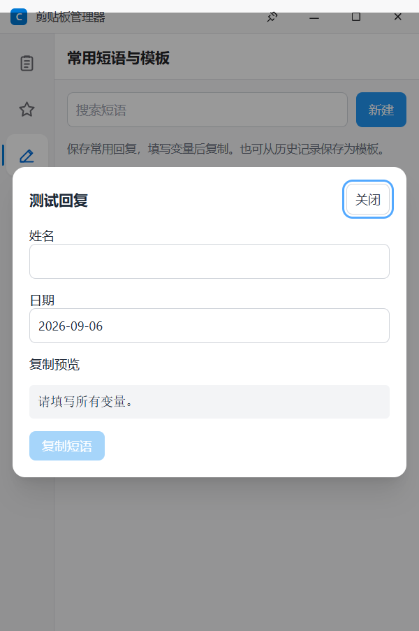
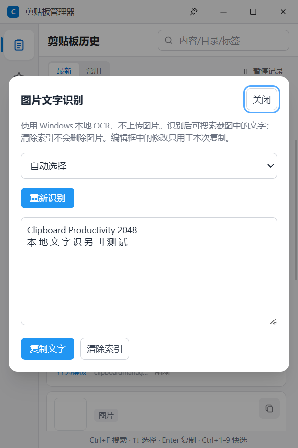
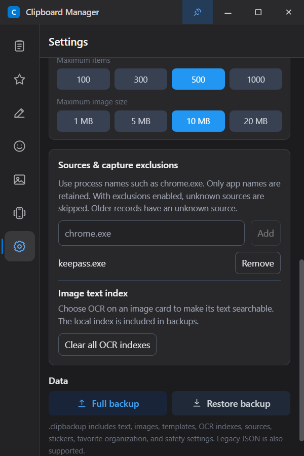

# 下一批效率功能：实施与验证

2026-09-06，版本 v1.2.1。本批功能已纳入 Windows 安装包；Android 配套端同步为 1.2.1 / 版本代码 8，手机功能不变。下载与发布验证见 [v1.2.1 发布说明](releases/v1.2.1.md)。

## 使用方式

| 功能 | 操作 | 范围 |
|---|---|---|
| 常用短语与变量模板 | 侧栏“常用短语”中新建，或从文字卡片“存为模板”；点击“使用”，填写变量并预览后复制 | `{{姓名}}` 等变量可重复引用；`{{日期}}` / `{{date}}`、`{{时间}}` / `{{time}}` 默认填入当前本地时间。最多 32 个变量、1,000 个模板、正文及生成结果各 10,000 字符 |
| 顺序粘贴 | 批量管理中选择 1–100 条文字，按列表顺序或倒序建立队列；切到目标应用，按 `Ctrl+Shift+Alt+V` 逐条粘贴 | 支持暂停、继续、跳过、退一条、重新选目标和结束。退一条只回退进度，不撤销目标内已粘贴的文字。队列不包含图片，不自动按 Tab / Enter，不自动提交表单 |
| 采集与置顶 | 自动生效；标题栏图钉切换窗口置顶 | 剪贴板通知驱动采集，2 秒序号检查用于恢复丢失通知；序号不变不读取图片。Windows 原生窗口样式确认置顶，成功后才保存偏好；托盘退出前写入待保存数据 |
| 本地 OCR 与搜索 | 图片卡片点 OCR，选择已安装的语言并识别；识别结果可编辑后复制，历史搜索同时匹配 OCR 索引 | 用户主动触发；可清除单张或所有索引。清除索引不删除图片。索引包含在备份中 |
| 来源与排除规则 | 历史/收藏页选择来源；设置中添加如 `chrome.exe`、`keepass.exe` 的进程名 | 只记录应用名称，不记录窗口标题或程序路径。最多 50 个精确匹配规则；旧记录来源为空，重复采集更新为最近一次来源 |

短语是独立数据，不改变原历史记录，也不因历史过期被清理。模板标题和列表预览沿用敏感信息遮罩。变量只做文字替换，不执行代码、命令或递归模板；没有后台监听全部键盘的文字展开器。

队列快捷键只在队列存在时注册，并保留给此功能。第一次按快捷键时绑定当前目标窗口和进程；之后焦点改变会暂停，用户可以回到原窗口后继续，或明确选择新目标。发送前再次检查窗口、进程、修饰键释放情况与剪贴板序号。忙碌时拒绝重复操作，失败不前移进度；超时或部分输入状态不确定时暂停，提示先检查目标内容。Windows 接受按键后才前移，但目标应用仍可能主动忽略粘贴；管理员窗口也可能受系统输入权限限制。

存在排除规则时，如果来源无法确定，跳过内容采集。移除排除规则、恢复记录或启动监控时重设基准，不补录之前的剪贴板内容。来源取剪贴板拥有者的进程名；通过系统代理复制的内容可能显示代理进程，而不是最初的编辑软件。

## OCR 和安装体积

使用 Windows 自带识别引擎，通过系统 Windows PowerShell 5.1 调用 WinRT；不上传图片，也不随应用下载或捆绑 OCR 模型。需要 Windows 已安装对应语言的 OCR 功能，可用语言在识别窗口列出。本机验证时有 `en-US` 和 `zh-Hans-CN`。

识别文件上限 20 MB / 1.2 亿像素；按系统引擎的最大尺寸缩放后识别，30 秒超时，同一时刻只处理一张图。索引上限 50,000 字符，复制上限 10,000 字符，超限显示提示。删除图片或清除索引会使正在处理的结果失效，避免清理后重新写入。

合成图片中的英文和中文均可被识别并检索；测试中个别汉字出现拆字，例如“别”被识别成分离的字形。复制前应校对，尤其是公式、表格、低分辨率截图。当前输出为文字，不重建表格结构或数学公式。

Windows 辅助程序为本机编译的约 14 KB .NET Framework 程序，另有约 4 KB OCR 脚本。没有新增 npm 运行依赖或 OCR 模型体积。开发、构建和打包前会自动调用系统 `csc.exe` 编译；要求 Windows 的 .NET Framework 编译器可用。辅助模块失败时，采集进入兼容模式；存在排除规则时仍跳过未知来源。顺序粘贴提示重启应用。

相关系统接口：[剪贴板变更通知](https://learn.microsoft.com/en-us/windows/win32/api/winuser/nf-winuser-addclipboardformatlistener)、[Windows OCR 引擎](https://learn.microsoft.com/en-us/uwp/api/windows.media.ocr.ocrengine)、[SendInput 及其权限限制](https://learn.microsoft.com/en-us/windows/win32/api/winuser/nf-winuser-sendinput)。

## 数据与备份

启动时为旧数据库增加来源、OCR 字段和独立模板表。`.clipbackup` 格式升至 2，包含上述字段、模板和排除规则；新版本可以导入格式 1 和旧 JSON。旧版本不能读取格式 2，避免悄悄漏掉模板。合并时按标题和正文去重模板，覆盖导入会替换模板库；确认窗口会明确说明。导入结束后同步设置界面并结束当前粘贴队列。

## 验证记录

- 37 项单元测试通过：变量替换和限制、来源规则、OCR 多词字面量搜索、新旧备份兼容性，以及全部原有测试。
- 主进程、渲染进程类型检查和生产构建通过。
- 实际 sql.js 数据库验证通过：迁移、备份合并/覆盖、来源/OCR/模板/规则保留、失败事务回滚和完整性检查。
- 原有完整 Electron 运行检查通过，包含之前间歇失败的置顶检查、重启后置顶恢复和已有的效率功能。
- 新增 Electron 检查通过：模板界面创建与复制、中文和英文 OCR/缓存/搜索/清理、来源采集、排除、暂停不补录、模板与索引重启持久化。
- 原生输入专项通过：独立测试窗口实际收到按顺序拼接的文字；暂停、跳过、退一条、改变窗口时拒绝输入、明确重新选择目标后继续。测试先核对真实前台窗口，只向合成测试窗口注入队列快捷键。
- 大图驻留测试：1800×1000 合成图片，4.3 秒内额外 PNG 编码为 **0 次**；一次测量中主进程 CPU 时间约 **31 ms**。这是本机单次检查，不代表所有图片、设备或整个应用的性能基准。
- 检查了默认 400×600、最小 320×400，中英文、浅色和深色的实际界面截图。长内容及设置支持滚动。
- 辅助模块终止后的回退验证通过：存在排除规则时，来源未知的合成内容未被采集；重启后辅助模块恢复。
- 构建了 Windows 目录包，确认原生辅助程序与 OCR 脚本随包携带。打包后的完整原有运行检查、新增功能检查（原生输入专项另行验证）、正常退出和重启检查通过，使用临时数据目录，未覆盖现有安装。

```powershell
npm.cmd test
npx.cmd tsc --noEmit -p tsconfig.node.json
npx.cmd tsc --noEmit -p tsconfig.web.json
npm.cmd run build
node scripts/database-smoke.mjs

# 原有完整运行检查
$env:RUNTIME_COPY_TESTS = '1'
node scripts/runtime-smoke.mjs

# 本批功能（原生输入测试期间需保持测试窗口在前台）
$env:RUNTIME_PRODUCTIVITY_ONLY = '1'
node scripts/runtime-smoke.mjs
```

测试使用临时数据库和合成内容，保存可支持的原剪贴板格式；结束时只有剪贴板仍与测试最后的内容一致才恢复，避免覆盖期间用户的新复制。`RUNTIME_SKIP_NATIVE_INPUT=1` 可单独跳过前台输入专项，输出会明确标注；`RUNTIME_QUEUE_ONLY=1` 只运行队列专项。其他剪贴板工具仍可能采集测试内容。

## 界面示例







## English

Version 1.2.1 implements phrases with variables, a guarded sequential text paste queue, Windows clipboard notifications and native topmost confirmation, user-triggered local OCR with searchable/removable indexes, and source-app filters/exclusions. Backup format 2 includes the new data and imports older formats. These features are included in the v1.2.1 Windows installer. Android is synchronized to 1.2.1 / version code 8 without phone feature changes.

Use **Phrases**, **Manage → Paste queue**, **OCR** on image cards, and **Settings → Sources & capture exclusions**. The queue shortcut is `Ctrl+Shift+Alt+V`; focus the destination yourself. Back rewinds the queue, not pasted content. OCR uses installed Windows language features, stays local, and can make recognition mistakes. The preview supports corrections before copying.
